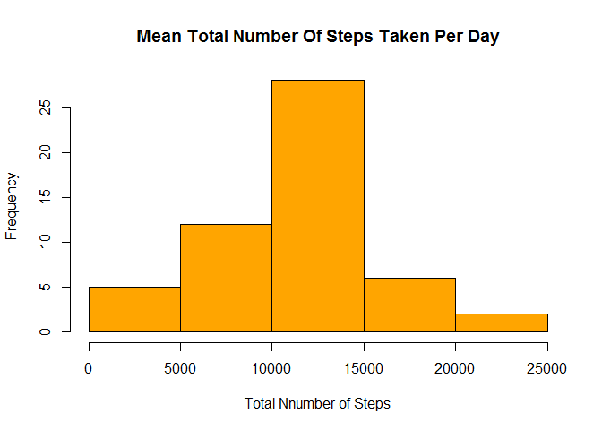
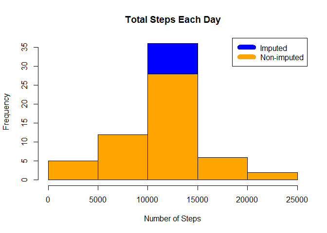

# Reproducible Research: Peer Assessment 1
##Loading Libraries

```r
library(ggplot2)
library(dplyr)
```

```
## 
## Attaching package: 'dplyr'
```

```
## The following objects are masked from 'package:stats':
## 
##     filter, lag
```

```
## The following objects are masked from 'package:base':
## 
##     intersect, setdiff, setequal, union
```

```r
library(chron)
```
## Loading and preprocessing the data

```r
setwd("C:/Users/narra/Documents/GitHub/RepData_PeerAssessment1")
df <- read.csv("data/activity.csv")
```

## What is mean total number of steps taken per day?

```r
df[,2]<-as.Date(df$date, format = "%Y-%m-%d")
steps_by_day <- aggregate(steps ~ date, df, sum)
hist(steps_by_day$steps,main="Mean Total Number Of Steps Taken Per Day",xlab="Total Nnumber of Steps",col="orange")
```

<!-- -->
##Calculate and report the mean and median total number of steps taken per day.

```r
rmean <- mean(steps_by_day$steps)
rmedian <- median(steps_by_day$steps)
```

## What is the average daily activity pattern?

```r
avgsteps_by_day <- aggregate(steps ~ interval, df, FUN="mean")
plot(avgsteps_by_day$interval,avgsteps_by_day$steps,type='l',xlab="Interval", ylab="Number of Steps",main="Average Number of Steps per Day by Interval")
```

<!-- -->


## Imputing missing values

```r
incomplete <- sum(!complete.cases(df))
imputed_data <- transform(df, steps = ifelse(is.na(df$steps), avgsteps_by_day$steps[match(df$interval, avgsteps_by_day$interval)], df$steps))
```
##  Histogram of the total number of steps taken each day with imputed data

```r
steps_by_day_i <- aggregate(steps ~ date, imputed_data, sum)

hist(steps_by_day_i$steps, main = paste("Total Steps Each Day"), col="blue", xlab="Number of Steps")

#Create Histogram to show difference. 
hist(steps_by_day$steps, main = paste("Total Steps Each Day"), col="orange", xlab="Number of Steps", add=T)
legend("topright", c("Imputed", "Non-imputed"), col=c("blue", "orange"), lwd=10)
```

<!-- -->
##Calculate and report the mean and median total number of steps taken per day.

```r
rmean.i <- mean(steps_by_day_i$steps)

rmedian.i <- median(steps_by_day_i$steps)
```
The imputed data mean is 1.0766189\times 10^{4}

The imputed data median is 1.0766189\times 10^{4}

##Calculate difference between imputed and non-imputed data

```r
mean_diff <- rmean.i - rmean
med_diff <- rmedian.i - rmedian
```

The imputed data mean difference 0

The imputed data median difference 1.1886792

##Calculate total difference.


```r
total_diff <- sum(steps_by_day_i$steps) - sum(steps_by_day$steps)
```

 Total Difference 8.6129509\times 10^{4}

## Are there differences in activity patterns between weekdays and weekends?

```r
weekdays <- c("Monday", "Tuesday", "Wednesday", "Thursday", 
              "Friday")
imputed_data$dow = as.factor(ifelse(is.element(weekdays(as.Date(imputed_data$date)),weekdays), "Weekday", "Weekend"))

steps_by_interval_i <- aggregate(steps ~ interval + dow, imputed_data, mean)

library(lattice)

xyplot(steps_by_interval_i$steps ~ steps_by_interval_i$interval|steps_by_interval_i$dow, main="Average Steps per Day by Interval",xlab="Interval", ylab="Steps",layout=c(1,2), type="l")
```

<!-- -->
